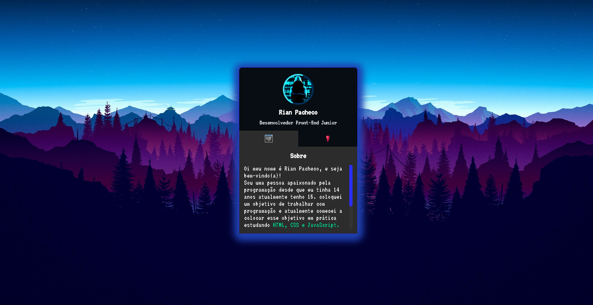
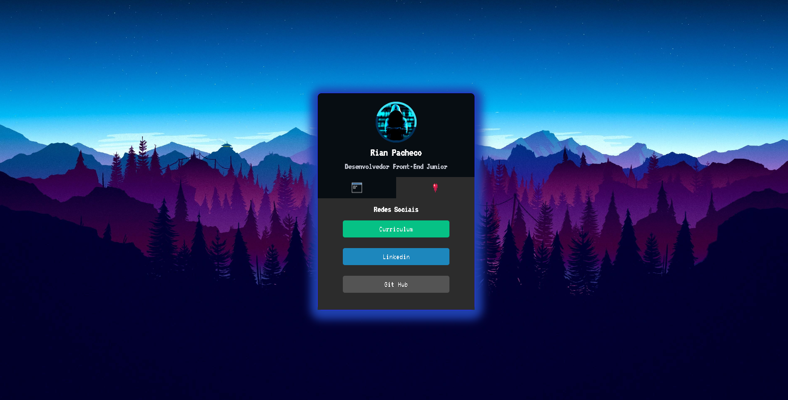
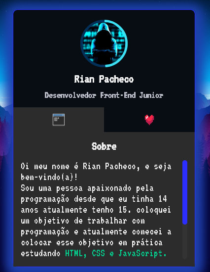
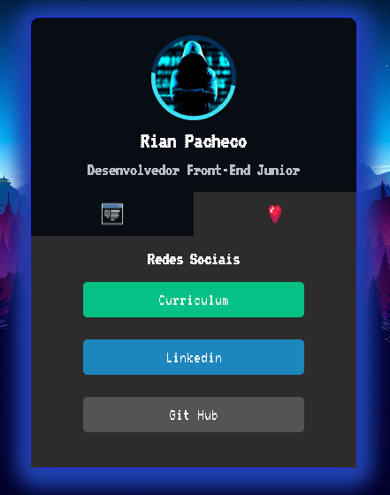

# Mini-Portfolio-mapa-dev-week &copy; Rian Pacheco 🚀

### link do projeto - https://rianpacheco.github.io/Mini-Portfolio/

 Projeto feito 100% para didática e colocar em pratica as tecnologias em front-end.

 Projeto feito do Desafio do Servidor Dev Quest..

## Preview Desktop

## Preview Mobile

# Tecnologias utilizadas

## Front end
- HTML
- CSS
- JAVASCRIPT

## Implantação em produção
- Front end web: GitHub.Io

# Autor

&copy; <a href="https://www.linkedin.com/in/rian-pacheco/"> Rian Pacheco</a>
